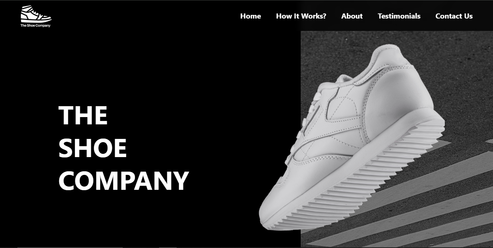
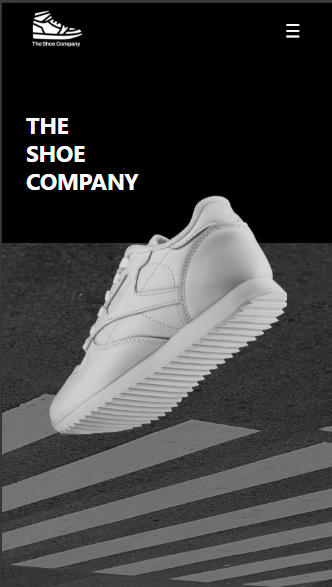

# 👟 The Shoe Company

A modern and fully responsive shoe company landing page built with **HTML and Tailwind CSS**.

This project was created as a practical project while learning **Tailwind CSS**. The goal was to take a visual design and turn it into a responsive website while practicing Tailwind's utility-first approach.

---

## 🚀 Live Demo

🔗 https://the-shoe-company-sanjudayal.netlify.app/

---

## 📸 Preview

### Desktop



### Mobile



---

## ✨ Features

- Fully responsive design
- Responsive navigation bar
- Mobile hamburger menu
- Smooth mobile menu animation
- Hero section
- Shoe features / "How It Works" section
- About Us section
- Customer testimonials section
- Contact section
- Embedded Google Maps
- Social media icons
- Smooth scrolling navigation
- Responsive typography and spacing
- Mobile, tablet, and desktop layouts

---

## 🛠️ Built With

- HTML5
- Tailwind CSS
- JavaScript
- Google Maps Embed

---

## 🎨 Tailwind CSS Concepts Practiced

This project helped me practice Tailwind CSS concepts including:

- Utility-first CSS
- Responsive breakpoints
- Flexbox
- Spacing utilities
- Width and height utilities
- Typography
- Positioning
- Background images
- Background sizing and positioning
- Borders and border radius
- Opacity
- Backdrop blur
- Transforms
- Transitions
- Responsive layouts
- Custom utility values
- `hover`, `md`, `lg`, and other responsive variants

---

## 📱 Responsive Design

The website was designed to work across different screen sizes:

- 📱 Mobile
- 📱 Tablet
- 💻 Laptop
- 🖥️ Desktop

The layout, typography, navigation, images, spacing, and content arrangement adapt according to the screen size.

---

## 📑 Website Sections

### 🏠 Hero Section

Introduces **THE SHOE COMPANY** with a large product-focused hero design.

### 👟 How It Works

Highlights important shoe features such as:

- The Heel
- The Front
- Traction

### ℹ️ About Us

Provides information about the company and its footwear collection.

### ⭐ Testimonials

Displays customer testimonials and reviews.

### 📍 Contact Us

Contains company contact information, social media icons, and an embedded Google Map.

---

## 🍔 Mobile Navigation

The desktop navigation is replaced with a hamburger menu on smaller screens.

JavaScript is used to control the mobile navigation by changing Tailwind classes such as:

```javascript
mobileMenu.classList.toggle("opacity-0");
mobileMenu.classList.toggle("invisible");
mobileMenu.classList.toggle("translate-x-5");
```

This creates the open/close behavior and transition effect for the mobile menu.

---

## 📚 JavaScript Concepts Practiced

Although this project primarily focuses on Tailwind CSS, JavaScript was used to add interactivity to the mobile navigation.

Concepts practiced:

- DOM selection
- Event listeners
- `classList`
- `toggle()`
- `add()`
- Event propagation
- `stopPropagation()`
- Mobile menu state management

---

## 📂 Project Structure

```text
the-shoe-company/
│
├── index.html
├── src/
│   ├── input.css
│   ├── output.css
│   └── script.js
│
├── images/
│   ├── logo.png
│   ├── the-white-shoe-hero-image.png
│   ├── how-it-works-image.png
│   ├── about-us-background.png
│   ├── about-shoe-company.png
│   ├── testimonial-bg.png
│   └── ...
│
└── README.md
```


---

## ▶️ Run Locally

### 1. Clone the repository

```bash
git clone https://github.com/sanjudayal/the-shoe-company.git
```

### 2. Navigate to the project

```bash
cd the-shoe-company
```

### 3. Install dependencies

If Tailwind CSS is configured through npm:

```bash
npm install
```

### 4. Start the development process

Use your configured Tailwind build command, or run the project using your preferred local development setup.

---

## 🎯 What I Learned

This was my first major project built using **Tailwind CSS**.

While building this project, I learned how to:

- Think in terms of utility classes instead of traditional CSS
- Build responsive layouts using Tailwind breakpoints
- Create complex layouts using Flexbox
- Position elements using Tailwind utilities
- Work with background images
- Create responsive typography
- Manage spacing and sizing across different screen sizes
- Create responsive navigation
- Add transitions and animations
- Combine Tailwind CSS with JavaScript
- Convert a visual design into a functional responsive website

The project was challenging because I was learning Tailwind CSS while building it, but it helped me understand how a utility-first CSS framework can be used to build complete interfaces.

---

## 🚀 Future Improvements

- Add product pages
- Add functional contact form
- Add product cards and pricing
- Add shopping/cart functionality
- Improve accessibility
- Add more animations and micro-interactions
- Add better navigation interactions
- Connect the website to a backend/API
- Improve performance and image optimization

---

## 👨‍💻 Author

**Sanju Dayal**

LinkedIn: https://linkedin.com/in/sanjudayal

GitHub: https://github.com/sanjudayal